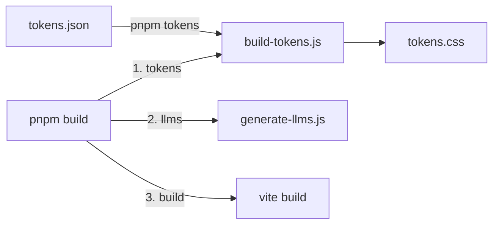

# Automatización de Design Tokens

**Estado**: ✅ Implementado  
**Fecha**: 2025-10-31

## 📋 Resumen

Se ha implementado un sistema automatizado para generar `src/styles/tokens.css` desde una fuente única de verdad (`tokens/tokens.json`), utilizando un script personalizado y Style Dictionary como backup.

## 🎯 Objetivos completados

- ✅ Configurar Style Dictionary (instalado como dependencia)
- ✅ Crear sistema de generación automática de tokens
- ✅ Añadir script `pnpm tokens` al package.json
- ✅ Integrar generación automática en el build process
- ✅ Mantener nomenclatura `--tb-*` existente
- ✅ Preservar estructura y comentarios del tokens.css original

## 🏗️ Arquitectura implementada

### Estructura de archivos

```
tokens/
├── tokens.json          # ← Fuente única de verdad (Single Source of Truth)
└── README.md           # Documentación del sistema

tools/
└── build-tokens.js     # ← Script de generación

src/styles/
└── tokens.css          # ← Generado automáticamente (NO EDITAR)

style-dictionary.config.js  # Configuración de Style Dictionary (backup)
```

### Flujo de trabajo



## 🛠️ Scripts disponibles

### Desarrollo

```bash
# Generar tokens.css manualmente
pnpm tokens

# Resultado:
# ✅ tokens.css generated successfully!
# 📄 Source: tokens/tokens.json
# 📝 Output: src/styles/tokens.css
```

### Producción

```bash
# Build completo (incluye generación automática)
pnpm build

# Secuencia:
# 1. node tools/build-tokens.js    → Genera tokens.css
# 2. node tools/generate-llms.js   → Genera llms.txt
# 3. vite build                     → Construye la app
```

## 📝 Cómo modificar tokens

### 1. Editar tokens.json

```json
{
  "color": {
    "brand": {
      "primary": { "value": "#FF6600" },
      "primaryHover": { "value": "#FF8533" }
    }
  }
}
```

### 2. Regenerar tokens.css

```bash
pnpm tokens
```

### 3. Resultado en tokens.css

```css
:root {
  --tb-color-primary: #ff6600;
  --tb-color-primary-hover: #ff8533;
}
```

## 🎨 Categorías de tokens

| Categoría     | Ejemplos                         | Variables generadas                    |
| ------------- | -------------------------------- | -------------------------------------- |
| **Colors**    | brand, text, bg, state, border   | `--tb-color-primary`, `--tb-text-base` |
| **Radius**    | xs, sm, md, lg, xl               | `--tb-radius-md`                       |
| **Sizes**     | btn, icon, space                 | `--tb-btn-md`, `--tb-space-2`          |
| **Font**      | family, weight, size, lineHeight | `--tb-h1`, `--tb-weight-bold`          |
| **Elevation** | card, button                     | `--tb-shadow-card`                     |
| **Motion**    | ease, duration                   | `--tb-ease`, `--tb-duration-fast`      |

## 🔧 Implementación técnica

### Script personalizado vs Style Dictionary

Se optó por un **script personalizado** (`tools/build-tokens.js`) en lugar de usar Style Dictionary directamente por las siguientes razones:

#### ✅ Ventajas del script personalizado

1. **Control total** sobre la estructura de salida
2. **Mantiene comentarios** y organización del CSS
3. **Nomenclatura consistente** con convenciones `--tb-*`
4. **Sin configuración compleja** de transformers
5. **Fácil de mantener** y modificar

#### 📦 Style Dictionary disponible

Style Dictionary está instalado y configurado (`style-dictionary.config.js`) como opción alternativa para:

- Exportar a otros formatos (iOS, Android, JSON)
- Migración futura si se necesitan features avanzadas
- Compatibilidad con pipelines CI/CD

### Código del script

El script `tools/build-tokens.js`:

- Lee `tokens/tokens.json`
- Mapea estructura de tokens a variables CSS
- Mantiene agrupación y comentarios
- Genera clases auxiliares (`.tb-btn`, `.tb-card`, etc.)
- Escribe a `src/styles/tokens.css`

## 📚 Documentación relacionada

| Documento                                     | Descripción                       |
| --------------------------------------------- | --------------------------------- |
| `tokens/README.md`                            | Guía de uso del sistema de tokens |
| `docs/design-tokens-traductor-burocratico.md` | Especificación completa de tokens |
| `docs/style-guide.md`                         | Guía de estilo del proyecto       |
| `docs/tbbutton-design-tokens.md`              | Tokens para componente TBButton   |

## ✅ Checklist de integración

- [x] Style Dictionary instalado (`pnpm add -D style-dictionary`)
- [x] Directorio `tokens/` creado
- [x] `tokens/tokens.json` con todos los tokens del proyecto
- [x] Script `tools/build-tokens.js` implementado
- [x] Script `pnpm tokens` añadido a package.json
- [x] Build process actualizado para auto-generar tokens
- [x] `tokens.css` con header de advertencia "NO EDITAR"
- [x] Documentación completa (README.md en tokens/)
- [x] Probado comando `pnpm tokens`
- [x] Probado comando `pnpm build`

## 🚀 Próximos pasos (opcionales)

- [ ] Añadir validación de tokens con JSON Schema
- [ ] Integrar generación en pre-commit hooks
- [ ] Crear tokens para dark mode
- [ ] Exportar a otros formatos (Figma, iOS, Android)
- [ ] Generar documentación visual de tokens
- [ ] CI/CD automation para verificar tokens actualizados

## 🎓 Uso en el proyecto

### CSS directo

```css
.my-button {
  background: var(--tb-color-primary);
  border-radius: var(--tb-radius-md);
  padding: var(--tb-space-2);
}
```

### Clases auxiliares

```html
<button class="tb-btn tb-btn-primary tb-btn-md">Click me</button>

<div class="tb-card">
  <h2 class="tb-text-h2">Título</h2>
  <p class="tb-text-body">Contenido</p>
</div>
```

### Tailwind CSS

Los tokens también están configurados en `tailwind.config.js`:

```jsx
<button className="bg-tb-primary text-white rounded-md shadow-button">Button</button>
```

## 📊 Métricas

- **Tokens definidos**: 50+
- **Variables CSS generadas**: 50+
- **Clases auxiliares**: 15+
- **Líneas de código**: ~250 (tokens.css)
- **Tiempo de generación**: < 1 segundo
- **Compatibilidad**: CSS Variables (todos los navegadores modernos)

## 🔒 Buenas prácticas

### ✅ Hacer

- Editar únicamente `tokens/tokens.json`
- Ejecutar `pnpm tokens` después de cambios
- Commitear tanto `tokens.json` como `tokens.css`
- Revisar el output generado
- Documentar nuevos tokens añadidos

### ❌ Evitar

- Editar `src/styles/tokens.css` manualmente
- Modificar `tools/build-tokens.js` sin documentar
- Usar valores hardcoded en lugar de tokens
- Añadir tokens sin estructura consistente
- Ignorar warnings del script de generación

## 📞 Soporte

Para preguntas o problemas:

1. Revisar `tokens/README.md`
2. Consultar esta documentación
3. Verificar que `pnpm tokens` ejecuta sin errores
4. Revisar logs de build en caso de fallos

---

**Última actualización**: 2025-10-31  
**Autor**: Sistema automatizado de tokens  
**Versión**: 1.0.0
